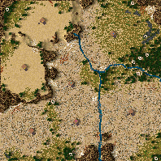

# Stronghold Maps
Maps for the games Stronghold and Stronghold Crusader

All Maps are GPL-2 licensed.

## Maps for Stronghold 1

You'll find these in the `./SH1/` directory.

### Wolf Finale Remake

This is an alternative version of the last mission of Stronghold 1. The Wolf has a big fancy actual castle with village and all, you have a ruined counter-castle. Your army is ready to take on the Wolf.

Here's the [first video of a series](https://youtube.com/watch?v=G9cogDyooaE) where my intended victim has his fun.

## Maps for Stronghold Crusader

You'll find these in the `./SHC/` directory.

### 1001 Schlacht

This was intended as a challenge map against all arabian lords. You are in the center, Sultan center left, Caliph center right, Nizar down right, Wazir down left, Saladin up right, Emir up left.

Played best with some old version of [my modded AIVs](https://github.com/Evrey/SHC_AIV).

Don't build past the swamp circles. =)

### Eingekesselte Trutz

Again, a challenge map. Pick six opponents, put yourself in the center.

### Helms Klamm

Yet another challenge map. [Here's the first video of a series](https://www.youtube.com/watch?v=zR5tDZEL8YM) of my victim having a good time with it.

### Im Nest der Ratte

Like all my maps, this one is ages old. This one isn't even done balancing for the intended restrictions, but it is doable.

More challenge maps, this time you down left versus the Rat up right. Plays best with my modded Rat. =) Don't underestimate your opponent. He has man power, well-protected resources, and his castle is difficult to reach. Prepare for a flood of enemies.

### Nachbarn im Klamm

Yet another Hornburg map. Fix the few flaws of the movie's castle and you are left with a pretty practical, cool-looking layout.

As you might have guessed, this is yet again a challenge map. You are put up right in the Hornburg, your opponent down left is... the Rat. Use all the resources you can get to defend yourself against thousands of the Rat's troops and watch the wall past the brook. You can't repair that section.

Here's the [first video of a series](https://www.youtube.com/watch?v=kLYFC1rYv2c) of my intended victim playing this map.

### Rache

Is this a challenge map? Myeah, I think this is a challenge map, intended for some old version of my AIV mods. Here's the idea:

- You are put down left.
- The Wolf, using a small castle, is put center left, bombarding you from a mountain.
- The Pig, also building a compact castle, sits up left guarding the path to the Wolf.
- The Snake sits down center in front of you.
- The Rat sits in the center between Snake and Pig.
- Down right is the Sheriff.
- The Abbot picks the big oasis up right.

## How To Install

### Windows

For Windows go to `C:\Users\<your name>\My Documents\Stronghold*\Maps**\` and drop the `.map` files of this repository there.

`*` Depending on the game, the game's directory is `Stronghold`, `Stronghold Crusader`, or `Stronghold Crusader Extreme`.

`**` For Stronghold Crusader Extreme, this is called `MapsExtreme`, whereas for the other titles it's just `Maps`.

### Linux

For Linux users with Steam Play:

The path to the corresponding `My Documents` directory is unique per game installation and depends on the Steam game ID. You'll find the `My Documents` directory in `steamapps/compatdata/<Game ID>/pfx/drive_c/users/steamuser/My Documents/`.

The game IDs are:

- `40950` for Stronghold 1.
- `40970` for Stronghold Crusader.
- `16700` for Stronghold Crusader Extreme.
